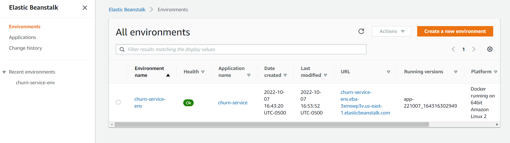
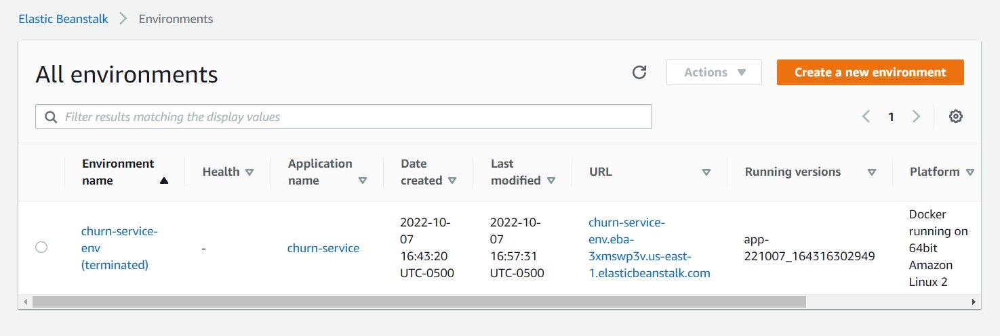

# AWS How-To

## First you need to install the CLI client

The AWS client does not need to be deployed with out package, so it is installed as a development dependency.

```bash
pipenv install awsebcli --dev
```

## How to use AWS utility

```bash
eb
usage: eb (sub-commands ...) [options ...] {arguments ...}

Welcome to the Elastic Beanstalk Command Line Interface (EB CLI).
For more information on a specific command, type "eb {cmd} --help".
...
```

## How to deploy a service

We initialize a new server by specifying:

* **-p**: The platform
* **-r**: The region
* **name**: The name of our service

```bash
eb init -p docker -r us-east-1 churn-service
Application churn-service has been created.
```

## How to view our service configuration settings

The settings are saved under `.elasticbeanstalk` in a `config.yml` file.

*config.yml*:

```yml
branch-defaults:
  default:
    environment: null
    group_suffix: null
global:
  application_name: churn-service
  branch: null
  default_ec2_keyname: null
  default_platform: Docker
  default_region: us-east-1
  include_git_submodules: true
  instance_profile: null
  platform_name: null
  platform_version: null
  profile: eb-cli
  repository: null
  sc: null
  workspace_type: Application

```

## Test our deployment locally before deploying online

```text
eb local run --port 9696
3.8.12-slim: Pulling from library/python
f7a1c6dad281: Already exists
92c59ec44e08: Already exists
08935196cb79: Already exists
7aa958b41dfb: Already exists
86c7a279e304: Already exists
Digest: sha256:a2d8844be9a3d5df8cd64c11bba476156cbfe5991db643c83e88ae383c15b5d0
Status: Downloaded newer image for python:3.8.12-slim
docker.io/library/python:3.8.12-slim
#1 [internal] load build definition from Dockerfile
#1 sha256:f598d2798816546a30f82ae679269d4f4bc8ec1f7aed565537e1e1b2b8834ea7
#1 transferring dockerfile: 314B done
#1 DONE 0.0s

#2 [internal] load .dockerignore
#2 sha256:4b9f00fb65a8b8e636f6f9bf7b0c174c098db21ef9e882627d634fe2aef01d89
#2 transferring context: 107B done
#2 DONE 0.0s

#3 [internal] load metadata for docker.io/library/python:3.8.12-slim
#3 sha256:ea8ad3d1ae137d96f8ff7926a5475c743eb2b7c57253e8813dc2a4dd55d30886
#3 DONE 0.0s

#4 [1/6] FROM docker.io/library/python:3.8.12-slim
#4 sha256:b1952a12e71952cc173801dd70923cd1c7dd6b3ddfe269f6e3774666b901f8ab
#4 DONE 0.0s

#7 [internal] load build context
#7 sha256:31ed7db2d585d1dca8382537e6a69999239ffa4ad7bec0d38631d28de79e670e
#7 transferring context: 34.60kB done
#7 DONE 0.0s

#5 [2/6] RUN pip install pipenv
#5 sha256:849366b29d053b3e37cabc5d2eca81431c4be4b4b11b466c0704c12650cd0256
#5 CACHED

#6 [3/6] WORKDIR /app
#6 sha256:23995d7658006f1ef4d075233fe3ae0b70e33205838793d9cf396fd16100ce1e
#6 CACHED

#8 [4/6] COPY [Pipfile, Pipfile.lock, ./]
#8 sha256:40098015eb50d3b0b0e5fcf6732bc63b3c31d0470b94999abb0db8ee2bd0ce94
#8 DONE 0.0s

#9 [5/6] RUN pipenv install --system --deploy
#9 sha256:f18bbaabd0170d115b57584a272984e999801a157e945aded541650f96e37ec2
#9 0.792 Installing dependencies from Pipfile.lock (6868b4)...
#9 DONE 20.2s

#10 [6/6] COPY [predict.py, model_C=1.0.bin, ./]
#10 sha256:edd7ac718a6f6e7a9a41778624c30cb66e8efca8ea7a3fdca51d2e947e771e35
#10 DONE 0.1s

#11 exporting to image
#11 sha256:e8c613e07b0b7ff33893b694f7759a10d42e180f2b4dc349fb57dc6b71dcab00
#11 exporting layers
#11 exporting layers 2.5s done
#11 writing image sha256:fb7e99e4a9d604581a8ad2c9cdad20af333062e81ddc6043d04d254685dc22d0
#11 writing image sha256:fb7e99e4a9d604581a8ad2c9cdad20af333062e81ddc6043d04d254685dc22d0 done
#11 naming to docker.io/library/bvi10x:5nijfk done
#11 DONE 2.5s
[2022-10-07 21:35:33 +0000] [1] [INFO] Starting gunicorn 20.1.0
[2022-10-07 21:35:33 +0000] [1] [INFO] Listening at: http://0.0.0.0:9696 (1)
[2022-10-07 21:35:33 +0000] [1] [INFO] Using worker: sync
[2022-10-07 21:35:33 +0000] [8] [INFO] Booting worker with pid: 8
```

## To deploy the service

```text
eb create churn-service-env
Creating application version archive "app-221007_164316302949".
Uploading churn-service/app-221007_164316302949.zip to S3. This may take a while.
Upload Complete.
Environment details for: churn-service-env
  Application name: churn-service
  Region: us-east-1
  Deployed Version: app-221007_164316302949
  Environment ID: e-rbjm5bmpe3
  Platform: arn:aws:elasticbeanstalk:us-east-1::platform/Docker running on 64bit Amazon Linux 2/3.5.0
  Tier: WebServer-Standard-1.0
  CNAME: UNKNOWN
  Updated: 2022-10-07 21:43:20.269000+00:00
Printing Status:
2022-10-07 21:43:18    INFO    createEnvironment is starting.
2022-10-07 21:43:20    INFO    Using elasticbeanstalk-us-east-1-672763491021 as Amazon S3 storage bucket for environment data.
2022-10-07 21:43:46    INFO    Created security group named: sg-0b70badb292bfea26
2022-10-07 21:44:02    INFO    Created load balancer named: awseb-e-r-AWSEBLoa-5THYQWHW8WJ2
2022-10-07 21:44:02    INFO    Created security group named: awseb-e-rbjm5bmpe3-stack-AWSEBSecurityGroup-1TJBC31VQS937
2022-10-07 21:44:02    INFO    Created Auto Scaling launch configuration named: awseb-e-rbjm5bmpe3-stack-AWSEBAutoScalingLaunchConfiguration-kJqlsHJIPoJo
2022-10-07 21:45:21    INFO    Created Auto Scaling group named: awseb-e-rbjm5bmpe3-stack-AWSEBAutoScalingGroup-NF5F6AU76CCQ
2022-10-07 21:45:22    INFO    Waiting for EC2 instances to launch. This may take a few minutes.
2022-10-07 21:45:22    INFO    Created Auto Scaling group policy named: arn:aws:autoscaling:us-east-1:672763491021:scalingPolicy:4ef2eef7-65fe-4215-a942-8f6ec84beea1:autoScalingGroupName/awseb-e-rbjm5bmpe3-stack-AWSEBAutoScalingGroup-NF5F6AU76CCQ:policyName/awseb-e-rbjm5bmpe3-stack-AWSEBAutoScalingScaleUpPolicy-oSuLq9cEHlzP
2022-10-07 21:45:22    INFO    Created Auto Scaling group policy named: arn:aws:autoscaling:us-east-1:672763491021:scalingPolicy:6f607a2b-6b1f-42f7-806f-7972fe023bed:autoScalingGroupName/awseb-e-rbjm5bmpe3-stack-AWSEBAutoScalingGroup-NF5F6AU76CCQ:policyName/awseb-e-rbjm5bmpe3-stack-AWSEBAutoScalingScaleDownPolicy-PD3LmRtXxeKp
2022-10-07 21:45:22    INFO    Created CloudWatch alarm named: awseb-e-rbjm5bmpe3-stack-AWSEBCloudwatchAlarmHigh-13VOSNWRJ7NYX
2022-10-07 21:45:22    INFO    Created CloudWatch alarm named: awseb-e-rbjm5bmpe3-stack-AWSEBCloudwatchAlarmLow-9RHJKZ77IBQK
2022-10-07 21:46:41    INFO    Instance deployment completed successfully.
2022-10-07 21:46:48    INFO    Application available at churn-service-env.eba-3xmswp3v.us-east-1.elasticbeanstalk.com.
2022-10-07 21:46:49    INFO    Successfully launched environment: churn-service-env
```

> The server is now availabe at: churn-service-env.eba-3xmswp3v.us-east-1.elasticbeanstalk.com

## How to stop the service

You can stop the service from the console at AWS, which looks like this:



or you can do it from the command line:

```text
eb terminate ch
urn-service-env
The environment "churn-service-env" and all associated instances will be terminated.
To confirm, type the environment name: churn-service-env
2022-10-07 21:53:52    INFO    terminateEnvironment is starting.
2022-10-07 21:53:52    INFO    Validating environment's EC2 instances have termination protection disabled before performing termination.
2022-10-07 21:53:52    INFO    Finished validating environment's EC2 instances for termination protection.
2022-10-07 21:54:10    INFO    Deleted CloudWatch alarm named: awseb-e-rbjm5bmpe3-stack-AWSEBCloudwatchAlarmHigh-13VOSNWRJ7NYX
2022-10-07 21:54:10    INFO    Deleted CloudWatch alarm named: awseb-e-rbjm5bmpe3-stack-AWSEBCloudwatchAlarmLow-9RHJKZ77IBQK
2022-10-07 21:54:10    INFO    Deleted Auto Scaling group policy named: arn:aws:autoscaling:us-east-1:672763491021:scalingPolicy:6f607a2b-6b1f-42f7-806f-7972fe023bed:autoScalingGroupName/awseb-e-rbjm5bmpe3-stack-AWSEBAutoScalingGroup-NF5F6AU76CCQ:policyName/awseb-e-rbjm5bmpe3-stack-AWSEBAutoScalingScaleDownPolicy-PD3LmRtXxeKp
2022-10-07 21:54:10    INFO    Deleted Auto Scaling group policy named: arn:aws:autoscaling:us-east-1:672763491021:scalingPolicy:4ef2eef7-65fe-4215-a942-8f6ec84beea1:autoScalingGroupName/awseb-e-rbjm5bmpe3-stack-AWSEBAutoScalingGroup-NF5F6AU76CCQ:policyName/awseb-e-rbjm5bmpe3-stack-AWSEBAutoScalingScaleUpPolicy-oSuLq9cEHlzP
2022-10-07 21:54:10    INFO    Waiting for EC2 instances to terminate. This may take a few minutes.
2022-10-07 21:56:42    INFO    Deleted Auto Scaling group named: awseb-e-rbjm5bmpe3-stack-AWSEBAutoScalingGroup-NF5F6AU76CCQ
2022-10-07 21:56:43    INFO    Deleted load balancer named: awseb-e-r-AWSEBLoa-5THYQWHW8WJ2
2022-10-07 21:56:58    INFO    Deleted Auto Scaling launch configuration named: awseb-e-rbjm5bmpe3-stack-AWSEBAutoScalingLaunchConfiguration-kJqlsHJIPoJo
2022-10-07 21:56:58    INFO    Deleted security group named: awseb-e-rbjm5bmpe3-stack-AWSEBSecurityGroup-1TJBC31VQS937
2022-10-07 21:57:29    INFO    Deleted security group named: sg-0b70badb292bfea26
2022-10-07 21:57:30    INFO    Deleting SNS topic for environment churn-service-env.
2022-10-07 21:57:32    INFO    terminateEnvironment completed successfully.
```

Once stopped, the console will show the same after refreshing the page:


