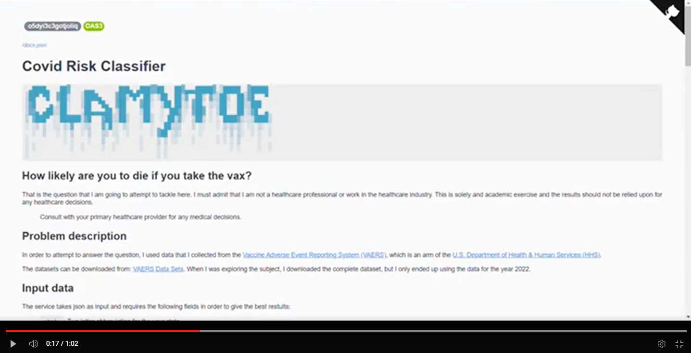

# Covid Risk Classifier

```bash
 ▄████████  ▄█          ▄████████   ▄▄▄▄███▄▄▄▄   ▄██   ▄       ███      ▄██████▄     ▄████████ 
███    ███ ███         ███    ███ ▄██▀▀▀███▀▀▀██▄ ███   ██▄ ▀█████████▄ ███    ███   ███    ███ 
███    █▀  ███         ███    ███ ███   ███   ███ ███▄▄▄███    ▀███▀▀██ ███    ███   ███    █▀  
███        ███         ███    ███ ███   ███   ███ ▀▀▀▀▀▀███     ███   ▀ ███    ███  ▄███▄▄▄     
███        ███       ▀███████████ ███   ███   ███ ▄██   ███     ███     ███    ███ ▀▀███▀▀▀     
███    █▄  ███         ███    ███ ███   ███   ███ ███   ███     ███     ███    ███   ███    █▄  
███    ███ ███▌    ▄   ███    ███ ███   ███   ███ ███   ███     ███     ███    ███   ███    ███ 
████████▀  █████▄▄██   ███    █▀   ▀█   ███   █▀   ▀█████▀     ▄████▀    ▀██████▀    ██████████ 
           ▀                                                                                    
```

## What does this do?

This classifier will predict the likelyhood of someone dying from taking the covid vaccination.
The dataset was collected from the [Vaccine Adverse Event Reporting System (VAERS)](https://vaers.hhs.gov/), which is an arm of the [U.S. Department of Health & Human Services (HHS)](https://www.hhs.gov/).

If you are interested in the actual raw data, the datasets can be downloaded from the VAERS Data Sets: [https://vaers.hhs.gov/data/datasets.html](https://vaers.hhs.gov/data/datasets.html).

These are the two datasets that were used:

* 2022VAERSDATA.csv
* 2022VAERSVAX.csv

## Running the model

The fastest way for you to run this model is to simply get the docker image [clamytoe/covid_risk_classifier](https://hub.docker.com/r/clamytoe/covid_risk_classifier) and run it locally.

### Download the image

```docker
docker pull clamytoe/covid_risk_classifier
```

### Start the service

```docker
docker run -it --rm -p 3000:3000 clamytoe/covid_risk_classifier serve --production
```

### Using the service

You can use the API by simply opening a browser to <http://localhost:3000>


If you scroll down a bit until you get to the **Service APIs** section and click on the **POST** drop down.


Once you've clicked on it to expand it, you will see a **Try it out** button.


Clicking on it will expose a text area with a schema of a valid input.


Enter your own values to try it out.
Due take note that at the top of the page, a description of each value is provided along with acceptable values.

Here is a sample for you to try:

```json
{
  "state": "tx",
  "age_yrs": 52,
  "sex": "f",
  "disable": 0,
  "other_meds": 1,
  "cur_ill": 0,
  "history": 0,
  "prior_vax": 0,
  "ofc_visit": 0,
  "allergies": 0,
  "vax_name": "moderna",
  "vax_dose_series": 1
}
```


Once you've entered your values, just click on the **Execute** button and scroll down a bit until you get to the *Server response* section.


In this case, we see that the user should be cautious if planning to take it.

## Sending multiple requests

If entering each patient's data takes too long, you can do something like what I'm doing with my `predict.py` script.

*predict.py:*

```python
import json

import requests

from service import CovidRisk

patients: list[CovidRisk] = [
    {
        "state": "mi",
        "age_yrs": 85,
        "sex": "f",
        "disable": 0,
        "other_meds": 0,
        "cur_ill": 0,
        "history": 0,
        "prior_vax": 0,
        "ofc_visit": 0,
        "allergies": 0,
        "vax_name": "pfizer\\biontech",
        "vax_dose_series": 2,
    },
    ...
    {
        "state": "tx",
        "age_yrs": 52,
        "sex": "f",
        "disable": 0,
        "other_meds": 1,
        "cur_ill": 0,
        "history": 0,
        "prior_vax": 0,
        "ofc_visit": 0,
        "allergies": 0,
        "vax_name": "moderna",
        "vax_dose_series": 1,
    },
]


def test_service(data: List[CovidRisk]):
    for patient in data:
        patient = json.dumps(patient)
        response = requests.post(
            "http://localhost:3000/classify",
            headers={"content-type": "application/json"},
            data=patient,
        ).json()
        print(response["status"], response["proba"])


if __name__ == "__main__":
    test_service(patients)
```

## Logging

I've enabled logging for the service.
In order to be able to keep the logs you will have to create a local mount point or a docker volume.
That's beyong the scope of this project, so I will leave that up to you to implement on your own.

### Log file location

* If you run the service locally, it is created in your project's root directory as `covid_risk_classifier.log`.
* If you run it from a docker image, it is created in `/home/bentoml/bento/src` with the same name.

*sample log entries:*

```log
cat covid_risk_classifier.log
...
2022-11-04T23:01:51.342665+0000 INFO Processing: state='tx' age_yrs=53 sex='f' disable=False other_meds=False cur_ill=False history=False prior_vax=False ofc_visit=False allergies=False vax_name='pfizer\\biontech' vax_dose_series=1
2022-11-04T23:01:51.347936+0000 INFO Probability: 0.19510182738304138
2022-11-04T23:01:51.348160+0000 INFO Prediction: {'status': 'SAFE', 'proba': 0.19510183}
2022-11-04T23:01:51.351920+0000 INFO Processing: state='ca' age_yrs=3 sex='m' disable=False other_meds=False cur_ill=False history=False prior_vax=False ofc_visit=False allergies=False vax_name='moderna' vax_dose_series=1
2022-11-04T23:01:51.357594+0000 INFO Probability: 0.003593571949750185
2022-11-04T23:01:51.357773+0000 INFO Prediction: {'status': 'SAFE', 'proba': 0.003593572}
2022-11-04T23:01:51.361099+0000 INFO Processing: state='tx' age_yrs=52 sex='f' disable=False other_meds=True cur_ill=False history=False prior_vax=False ofc_visit=False allergies=False vax_name='moderna' vax_dose_series=1
2022-11-04T23:01:51.366562+0000 INFO Probability: 0.13526801764965057
2022-11-04T23:01:51.366764+0000 INFO Prediction: {'status': 'SAFE', 'proba': 0.13526802}
```

## Short demo of it running on AWS

[](https://youtu.be/DiqvK98TG68)

## Further reading

If you want to dig in more and take a look at what it takes to create your own classifier, then a look at the [HOW-TO.md](HOW-TO.md) file.
