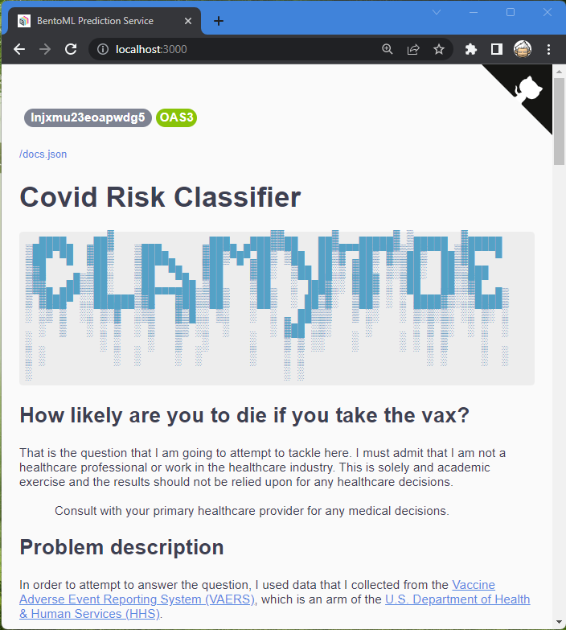
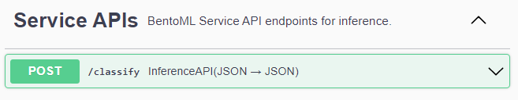
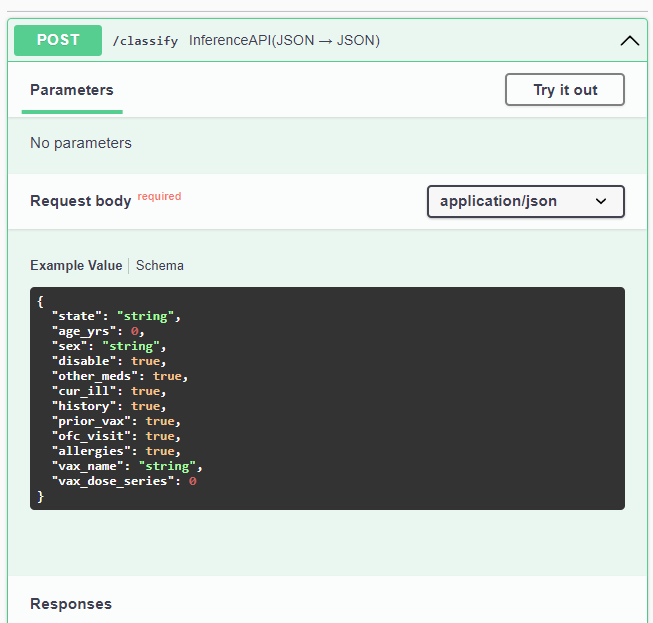
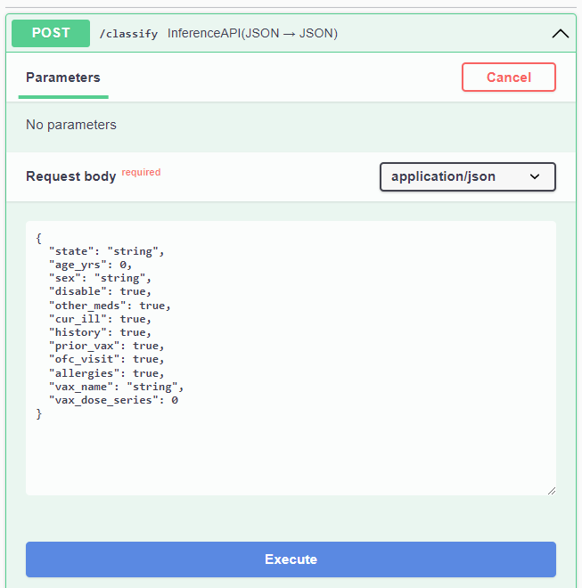
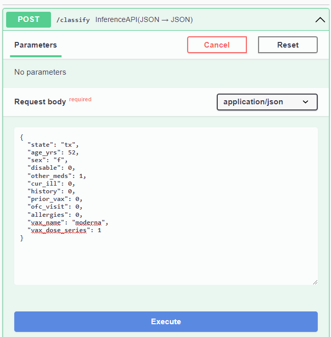
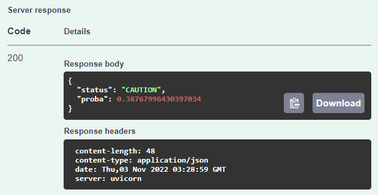

# Covid Risk Classifier

```bash
 ▄████████  ▄█          ▄████████   ▄▄▄▄███▄▄▄▄   ▄██   ▄       ███      ▄██████▄     ▄████████ 
███    ███ ███         ███    ███ ▄██▀▀▀███▀▀▀██▄ ███   ██▄ ▀█████████▄ ███    ███   ███    ███ 
███    █▀  ███         ███    ███ ███   ███   ███ ███▄▄▄███    ▀███▀▀██ ███    ███   ███    █▀  
███        ███         ███    ███ ███   ███   ███ ▀▀▀▀▀▀███     ███   ▀ ███    ███  ▄███▄▄▄     
███        ███       ▀███████████ ███   ███   ███ ▄██   ███     ███     ███    ███ ▀▀███▀▀▀     
███    █▄  ███         ███    ███ ███   ███   ███ ███   ███     ███     ███    ███   ███    █▄  
███    ███ ███▌    ▄   ███    ███ ███   ███   ███ ███   ███     ███     ███    ███   ███    ███ 
████████▀  █████▄▄██   ███    █▀   ▀█   ███   █▀   ▀█████▀     ▄████▀    ▀██████▀    ██████████ 
           ▀                                                                                    
```

## How likely are you to die if you take the vax?

That is the question that I am going to attempt to tackle here.
I must admit that I am not a healthcare professional or work in the healthcare industry.
This is solely and academic exercise and the results should not be relied upon for any healthcare decisions.

> Consult with your primary healthcare provider for any medical decisions.

## Problem description

In order to attempt to answer the question, I used data that I collected from the [Vaccine Adverse Event Reporting System (VAERS)](https://vaers.hhs.gov/), which is an arm of the [U.S. Department of Health & Human Services (HHS)](https://www.hhs.gov/).

The datasets can be downloaded from: [VAERS Data Sets](https://vaers.hhs.gov/data/datasets.html).
When I was exploring the subject, I downloaded the complete dataset, but I only ended up using the data for the year 2022.

* 2022VAERSDATA.csv
* 2022VAERSVAX.csv

## Running the model

The fastest way for you to run this model is to simply get the [docker image](https://hub.docker.com/repository/docker/clamytoe/covid_risk_classifier) and run it locally.

### Download the image

```docker
docker pull clamytoe/covid_risk_classifier
```

### Start the service

```docker
docker run -it --rm -p 3000:3000 clamytoe/covid_risk_classifier serve --production
```

### Using the service

You can use the API by simply opening a browser to <http://localhost:3000>



If you scroll down a bit until you get to the **Service APIs** section and click on the **POST** drop down.



Once you've clicked on it to expand it, you will see a **Try it out** button.



Clicking on it will expose a text area with a schema of a valid input.



Enter your own values to try it out.
Due take note that at the top of the page, a description of each value is provided along with acceptable values.

Here is a sample for you to try:

```json
{
  "state": "tx",
  "age_yrs": 52,
  "sex": "f",
  "disable": 0,
  "other_meds": 1,
  "cur_ill": 0,
  "history": 0,
  "prior_vax": 0,
  "ofc_visit": 0,
  "allergies": 0,
  "vax_name": "moderna",
  "vax_dose_series": 1
}
```



Once you've entered your values, just click on the **Execute** button and scroll down a bit until you get to the *Server response* section.



In this case, we see that the user should be cautious if planning to take it.

## Sending multiple requests

If entering each patient's data takes too long, you can do something like what I'm doing to test the service.

*test_service.py:*

```python
import json

import requests

from service import CovidRisk

patients: list[CovidRisk] = [
    {
        "state": "mi",
        "age_yrs": 85,
        "sex": "f",
        "disable": 0,
        "other_meds": 0,
        "cur_ill": 0,
        "history": 0,
        "prior_vax": 0,
        "ofc_visit": 0,
        "allergies": 0,
        "vax_name": "pfizer\\biontech",
        "vax_dose_series": 2,
    },
    ...
    {
        "state": "tx",
        "age_yrs": 52,
        "sex": "f",
        "disable": 0,
        "other_meds": 1,
        "cur_ill": 0,
        "history": 0,
        "prior_vax": 0,
        "ofc_visit": 0,
        "allergies": 0,
        "vax_name": "moderna",
        "vax_dose_series": 1,
    },
]


def test_service(data: List[CovidRisk]):
    for patient in data:
        patient = json.dumps(patient)
        response = requests.post(
            "http://localhost:3000/classify",
            headers={"content-type": "application/json"},
            data=patient,
        ).json()
        print(response["status"], response["proba"])


if __name__ == "__main__":
    test_service(patients)
```

## Further reading

If you want to dig in more and take a look at what it takes to create your own classifier, then a look at the [HOW-TO.md](HOW-TO.md) file.
